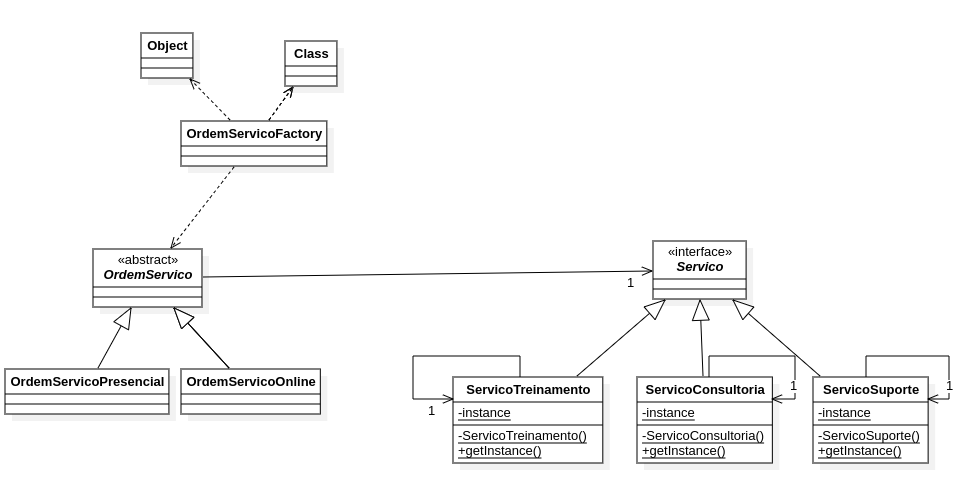

# Ordem de Serviço - Padrões de Projeto

Este é um sistema de Ordem de Serviço que implementa três padrões de projeto principais: **Bridge**, **Factory Method** e **Singleton**. O sistema possui como funcionalidade principal a geração do custo de uma ordem de serviço, e sua estrutura está detalhada no diagrama de classes abaixo.

---

## Diagrama de Classes

---